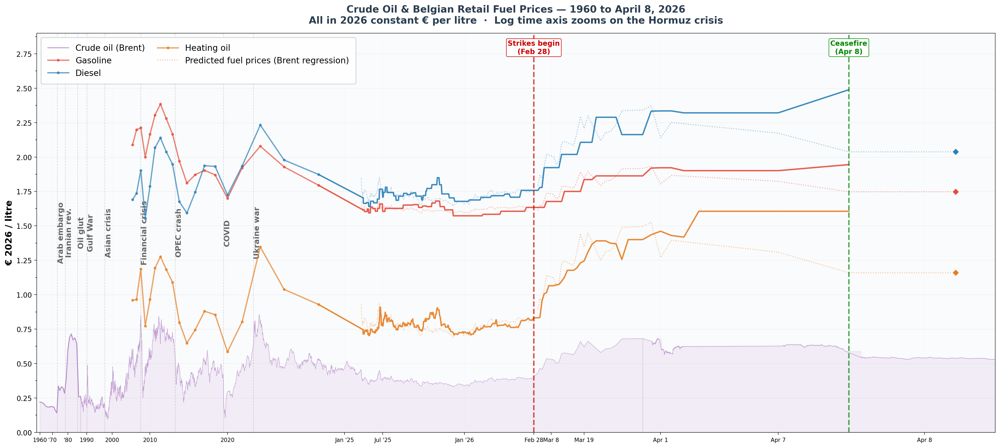

# Combined Figure: Crude Oil & Belgian Retail Fuel Prices (1960–2026)

A single high-resolution chart showing 65 years of crude oil and Belgian retail fuel prices, all expressed in **constant 2026 euros per litre**, with a logarithmic time axis that naturally zooms into the 2026 Strait of Hormuz crisis.



## Output

The script generates `images/fig_combined_logtime.png` (and `.pdf`):

- **Purple area/line**: Crude oil (Brent) in €2026/L — annual averages from 1960, daily from 1987, 5-minute ticks for the final week.
- **Red line**: Gasoline (Essence 95 RON E10) retail price.
- **Blue line**: Diesel (B7) retail price.
- **Orange line**: Heating oil (Gasoil chauffage, ≥2000 L delivery) retail price.
- **Dotted lines**: Regression-predicted fuel prices based on Brent crude.
- **Vertical dashed lines**: Historical crises (1973 embargo, 1979 Iranian revolution, …) and the Feb 28 / Apr 8, 2026 crisis events.

## How it was generated

```bash
python fig_combined.py
```

On first run, the script automatically downloads and caches several FRED macroeconomic series in `data/`. Subsequent runs use the cached files.

### Data pipeline

1. **Historical crude (annual, 1960–2026)**: Built from FRED monthly WTI (pre-1987) and Brent (post-1987), converted to EUR using OECD/FRED exchange rates, deflated by Belgian CPI from FRED.
2. **Daily Brent crude (1987–2026)**: FRED daily Brent in USD → converted with FRED EUR/USD daily rate → deflated with monthly Belgian CPI.
3. **Tick-level Brent (Mar 31 – Apr 8, 2026)**: 5-minute ICE/broker data, converted at the Apr 8 spot EUR/USD rate (1.10).
4. **Belgian retail fuel prices (yearly, 2006–2026)**: Loaded from beSTAT (Statbel/FOD Economie) yearly averages, deflated to €2026 using FRED Belgian CPI.
5. **Belgian retail fuel prices (daily, Apr 2025 – Apr 2026)**: Loaded from beSTAT daily maximum prices.
6. **Regression predictions**: Linear models (Brent EUR/bbl → retail price) with separate normal-regime and crisis-regime coefficients, estimated from beSTAT vs. Brent regressions.

### Hypotheses and assumptions

- **Deflation**: All prices are expressed in constant 2026 euros. The deflator is the Belgian CPI (FRED series BELCPIALLMINMEI, base 2015=100). For 2026, CPI is extrapolated from the latest available year assuming ~2.1% annual inflation (parameter `CPI_GROWTH_2026`).
- **EUR/USD for 2026**: Fixed at 1.10 (spot rate on April 8, 2026).
- **Crude oil 2026 annual average**: Assumed at $95/bbl for the full-year average (used for the annual series endpoint).
- **Gasoline pre-2014**: beSTAT E10 data is not available before 2014; the script falls back to E5 (Essence 95 RON E5) for years 2006–2013.
- **Log time axis**: The x-axis shows "days before April 8, 2026 16:00" on a log₁₀ scale, which compresses decades into the left portion and expands recent days/hours on the right. This naturally provides multi-scale resolution.
- **Crisis regime (Feb 28 – Apr 8, 2026)**: The regression model uses separate slope/intercept coefficients for the crisis period (Strait of Hormuz blockade), reflecting elevated crack spreads and panic pricing.
- **Pre-1999 exchange rate**: For daily Brent before the euro existed (1987–1998), the EUR/USD rate is back-filled from the earliest available FRED value. The annual crude series uses OECD BEF/USD data converted to EUR-equivalent.

## Data sources

### Bundled in `data/`

| File | Description | Source |
|------|-------------|--------|
| `beSTAT_oil_prices_belgium_2006-2026_yearly.csv` | Yearly average Belgian retail fuel prices (incl. VAT) | [Statbel / FOD Economie](https://bestat.statbel.fgov.be/) |
| `beSTAT_oil_prices_belgium_2025-2026_daily.csv` | Daily Belgian retail fuel prices (incl. VAT) | [Statbel / FOD Economie](https://bestat.statbel.fgov.be/) |
| `FRED_DCOILBRENTEU.csv` | Daily Brent crude oil price (USD/bbl), 1987–2026 | [FRED / EIA](https://fred.stlouisfed.org/series/DCOILBRENTEU) |
| `BRENTCRUDEOIL_2026-04-08.txt` | 5-minute tick data for Brent crude, Mar 31 – Apr 8, 2026 | ICE / broker platform |
| `regression_coefficients.csv` | Linear regression coefficients (Brent → retail fuel price) | Derived from beSTAT vs. FRED Brent |

### Auto-downloaded from FRED (cached in `data/`)

| Series | Description | URL |
|--------|-------------|-----|
| `WTISPLC` | WTI crude oil monthly average (USD/bbl) | [FRED](https://fred.stlouisfed.org/series/WTISPLC) |
| `MCOILBRENTEU` | Brent crude oil monthly average (USD/bbl) | [FRED](https://fred.stlouisfed.org/series/MCOILBRENTEU) |
| `BELCPIALLMINMEI` | Belgian CPI, all items (OECD, base 2015=100) | [FRED](https://fred.stlouisfed.org/series/BELCPIALLMINMEI) |
| `EXUSEU` | EUR/USD exchange rate (USD per EUR) | [FRED](https://fred.stlouisfed.org/series/EXUSEU) |
| `CCUSMA02BEA618N` | Belgium national currency per USD (OECD) | [FRED](https://fred.stlouisfed.org/series/CCUSMA02BEA618N) |

## Requirements

- Python 3.8+
- `numpy`, `pandas`, `matplotlib`
- Internet connection on first run (to download FRED data)
